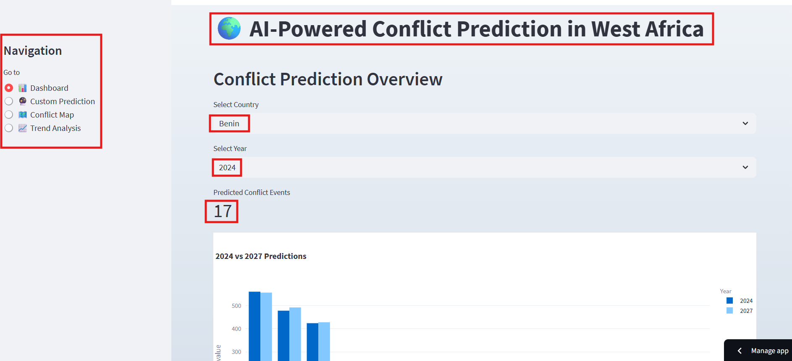
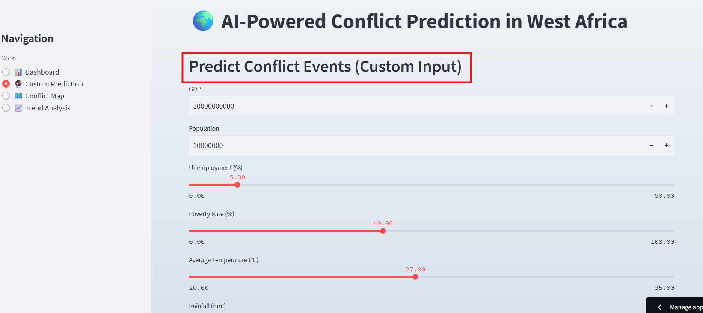
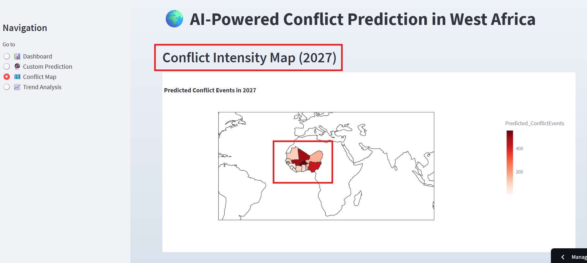

# Conflict Prediction Dashboard for West Africa

[](https://conflict-prediction-west-africa-ade-fadil.streamlit.app/)

## 🔹 Project Overview

This project predicts **conflict events in West African countries** using **climate, socio-economic, and population data**. It leverages **machine learning** to provide insights for policymakers, researchers, and humanitarian organizations about potential conflict risks.

The predictions include both **2024 and 2027 conflict estimates**, giving a short-term and medium-term view of political instability in the region.

**Live Dashboard:** [Click here to view](https://conflict-prediction-west-africa-ade-fadil.streamlit.app/)

**Research PDF:** [Conflict Prediction Research](Conflict_Prediction_Research.pdf)

---

## 🔹 Why This Project Matters

Conflicts in West Africa affect millions of people and hinder economic and social development. By combining **climate data (temperature, rainfall)** with **economic and social indicators (GDP, unemployment, poverty)**, this dashboard provides actionable insights to:

- Anticipate high-risk regions for conflicts  
- Support humanitarian planning and resource allocation  
- Inform research on conflict trends  

---

## 🔹 Timeline of Key Conflict Events

| Year      | Event / Prediction |
|-----------|------------------|
| 2015      | Significant unrest in Nigeria and Mali |
| 2016–2017 | Rising conflicts in Burkina Faso |
| 2018      | Escalation in northern Niger |
| 2019–2020 | Conflict spreads in Côte d’Ivoire and Ghana |
| 2021–2023 | Peaks in regional instability |
| 2024      | Model predicts high conflict in Burkina Faso, Nigeria |
| 2027      | Predicted trends indicate increasing risks in Togo and Mauritania |

---

## 🔹 Data Sources

| Type                    | Source |
|-------------------------|--------|
| Conflict Events         | [ACLED](https://acleddata.com/) |
| GDP, Population, Poverty| [World Bank](https://data.worldbank.org/) |
| Climate (Temp, Rainfall)| Public meteorological datasets |

All datasets are **merged** and preprocessed to create a clean dataset for model training.

---

## 🔹 Machine Learning Model

We use a **Random Forest Regressor** to predict conflict events.  

### Key Points:

- Predicts the **number of conflict events** per country per year  
- Features used: `Population`, `Unemployment`, `AvgTemp`, `GDP`, `Rainfall`, `PovertyRate`  
- Model accuracy: **R² ≈ 0.94**, **MAE ≈ 4.8**, **RMSE ≈ 7.7**  
- Generates **predictions for 2024 and 2027**  

### Feature Importance:

| Feature        | Importance |
|----------------|------------|
| Population     | 33%        |
| Unemployment   | 29%        |
| AvgTemp        | 14%        |
| GDP            | 11%        |
| Rainfall       | 7%         |
| PovertyRate    | 6%         |

---

## 🔹 Predictions (Sample)

| Country        | Year | Predicted Conflict Events |
|----------------|------|--------------------------|
| Benin          | 2024 | 17                       |
| Burkina Faso   | 2024 | 560                      |
| Côte d’Ivoire  | 2024 | 44                       |
| Nigeria        | 2024 | 424                      |
| Benin          | 2027 | 137                      |
| Burkina Faso   | 2027 | 556                      |
| Côte d’Ivoire  | 2027 | 94                       |
| Nigeria        | 2027 | 428                      |

> Full predictions are saved in `data/processed/predicted_conflict_events.csv`.

---

## 🔹 Dashboard Screenshots

**Dashboard Overview**  


**Custom Prediction**  


**Conflict Map Intensity**  


---

## 🔹 How to Run Locally

1. Clone the repo:

```bash
git clone https://github.com/available-pixel/conflict-prediction-west-africa.git
cd conflict-prediction-west-africa

2. Create a virtual environment:

python -m venv venv
source venv/bin/activate   # Linux/Mac
venv\Scripts\activate      # Windows

3. Install dependencies:

pip install -r requirements.txt

4. Run the app:

streamlit run app.py
```

---

### 🔹 Future Improvements

- Add interactive maps for conflict hotspots
- Include additional socio-economic features (education, health indicators)
- Experiment with time-series models to improve 2027 predictions
- Add downloadable CSVs for end users

---

## 🔹 License

This project is open-source. Feel free to use it for educational or research purposes.

---

## 🔹 Contact

Fadil Owolara ADELABOU

GitHub Repository: available-pixel/conflict-prediction-west-africa
Streamlit App: Live Dashboard
Research PDF: Conflict Prediction Research

---
